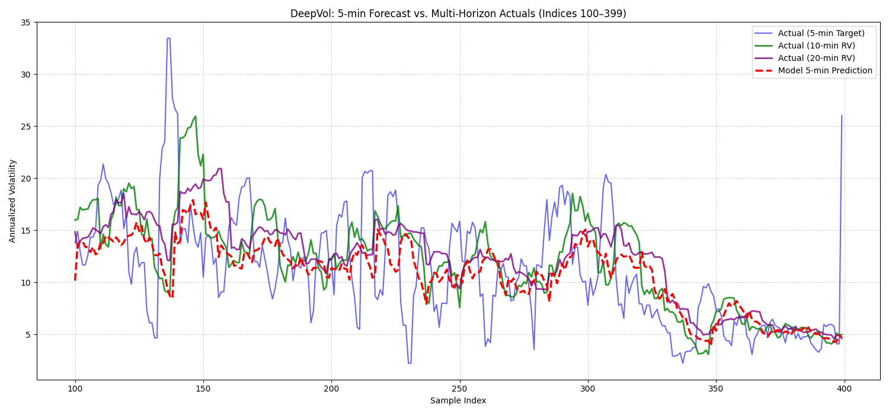

# DeepVol: Intraday Volatility Forecasting on USO

**Research seminar project** — forecasting short-horizon realized volatility of the United States Oil Fund (USO) from minute-level price data using a dilated causal convolutional network (DeepVol), benchmarked against classical volatility models.

## Overview

USO is an ETF that tracks front-month WTI crude oil futures. Using minute bars across both regular and extended trading hours, the project:

1. **Explores what "volatility" means at high frequency.** Instantaneous, realized, rolling, EWMA and implied volatility; the effect of market microstructure noise at very short horizons; and why regular-session and after-hours volatility behave differently.
2. **Builds forecasting targets.** Multi-horizon realized volatility (5, 10, 20 and 30 minutes) and an EWMA volatility proxy, both annualized for a 390-minute trading day.
3. **Trains a DeepVol model.** A WaveNet-style stack of gated dilated causal convolutions with residual and skip connections, predicting next-5-minute (log) volatility from a rolling window of past values.
4. **Benchmarks and evaluates.** Compares against a GARCH(1,1) baseline and reports RMSE / MAE on volatility and QLIKE on variance, plus plots of predicted vs. realized volatility at each horizon.

## Model

| Component | Detail |
|---|---|
| Architecture | Gated dilated causal 1-D convolutions (residual + skip), 4 blocks |
| Input | Rolling window of past log-volatility (default 10 steps) |
| Target | Next 5-min realized volatility / EWMA volatility |
| Loss | L1 (MAE) |
| Training | PyTorch Lightning, Adam, ReduceLROnPlateau, early stopping |
| Split | Chronological train / validation / test (no shuffling across time) |

## Repository layout

```
what-is-vol.ipynb / .py   # volatility concepts, target definition, horizon correlations
eda.ipynb                 # exploratory analysis of USO minute data (session effects, intraday patterns)
modelling.ipynb           # session-aware returns, rolling vol, GARCH(1,1) baseline
data_loading.py           # chronological train / valid / test split with log returns
data_prep.py              # realized-vol computation and sequence construction
main.py                   # DeepVol on realized-volatility targets
deepvol_ewma.py           # DeepVol on EWMA-volatility targets
*.pth                     # trained model weights
comparison_*.png          # predicted vs. actual volatility by horizon
scatter_*.png             # predicted vs. actual scatter plots
```

HTML exports of the notebooks (`eda.html`, `modelling.html`, `what-is-vol.html`) can be opened directly in a browser.

## Results



## Running it

```bash
python -m venv venv && source venv/bin/activate
pip install -r rqmts.txt
python main.py            # realized-volatility model
python deepvol_ewma.py    # EWMA-volatility model
```

Both scripts expect minute-bar data in `final.csv` with `timestamp`, `close` and `market_status` columns.

## Tech stack

Python · PyTorch · PyTorch Lightning · pandas · NumPy · arch (GARCH) · scikit-learn · matplotlib
